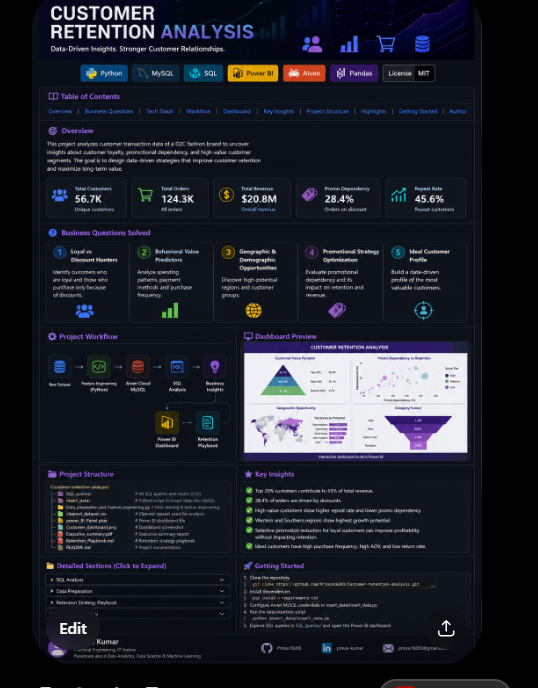

<div align="center">



# 📊 Customer Retention Analysis

### SQL • Python • MySQL • Power BI • Aiven Cloud

</div>

<p align="center">


</p>

## 📑 Table of Contents

- [Overview](#-overview)
- [Tech Stack](#-tech-stack)
- [Business Questions](#-business-questions-solved)
- [Workflow](#-project-workflow)
- [Dashboard](#-dashboard-preview)
- [Repository Structure](#-repository-structure)
- [Key Insights](#-key-insights)
- [Author](#-author)

# 🎯 Overview

This project develops a data-driven retention strategy for a D2C fashion brand using:

- Python
- MySQL (Aiven Cloud Database)
- SQL
- Power BI

The objective is to identify customer behavior patterns and provide business recommendations to improve customer retention.

# 📈 Dashboard Preview

<p align="center">


</p>

# 📊 SQL Analysis

<details>

<summary><b>Click to Expand</b></summary>

### 1️⃣ Loyal vs Discount Hunters

- Customer segmentation
- Promotion dependency

### 2️⃣ Behavioral Predictors

- Spending patterns
- Payment methods
- Purchase frequency

### 3️⃣ Geographic Opportunities

- Demographic analysis
- High-value regions

### 4️⃣ Promotional Strategy

- Revenue dependency
- Promotion optimization

### 5️⃣ Ideal Customer Profile

- High-value customer characteristics

</details>


# 🔄 Project Workflow

```text
Raw Dataset
     ↓
Feature Engineering (Python)
     ↓
Aiven Cloud MySQL
     ↓
SQL Analysis
     ↓
Business Insights
     ↓
Power BI Dashboard
     ↓
Retention Playbook
```

# 📂 Repository Structure

```text
Customer-retention-analysis
│
├── images/
├── SQL_queries/
├── insert_data/
├── cleaned_dataset.csv
├── Data_preparation_and_Feature_engineering.py
├── Customer_dashboard.png
├── power_BI_Panel.pbix
├── Executive_summary.pdf
├── Retention_Playbook.md
└── README.md
```