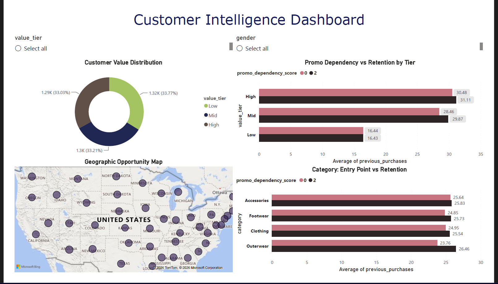

<div align="center">

# 📊 Customer Retention Analysis

### SQL • Python • MySQL • Power BI • Aiven Cloud


End-to-end customer analytics project focused on understanding customer behavior, promotional dependency and designing retention strategies.

</div>

---

# 🚀 Project Overview

This project analyzes customer transaction data of a D2C fashion brand to uncover insights about customer loyalty, spending patterns, promotional dependency, and high-value customer segments.

The complete pipeline consists of:

* Data Cleaning and Feature Engineering
* Cloud Database Integration (Aiven MySQL)
* SQL Analysis
* Business Recommendations
* Power BI Dashboard
* Customer Retention Playbook

---

# 🛠 Tech Stack

| Category       | Tools    |
| -------------- | -------- |
| Programming    | Python   |
| Database       | MySQL    |
| Cloud Database | Aiven    |
| Visualization  | Power BI |
| Analysis       | SQL      |
| Libraries      | Pandas   |

---

# 🔄 Project Workflow

```text
Raw Dataset
     ↓
Feature Engineering (Python)
     ↓
Aiven Cloud MySQL Database
     ↓
SQL Analysis
     ↓
Business Insights
     ↓
Power BI Dashboard
     ↓
Retention Playbook
```

---

# ❓ Business Questions Solved

### 🎯 Loyal vs Discount Hunters

Identified customers whose purchasing decisions are driven by loyalty rather than promotions.

### 📈 Behavioral Value Predictors

Studied spending patterns, payment preferences, and purchasing frequency.

### 🌎 Geographic Opportunities

Identified regions and demographics with high growth potential.

### 💰 Promotional Strategy Optimization

Analyzed promotional dependency and revenue contribution.

### 👑 Ideal Customer Profile

Built a data-driven profile of high-value customers.

---

# 📊 Dashboard Preview

<p align="center">

</p>

---

# 📂 Repository Structure

```text
Customer-retention-analysis
│
├── SQL_queries/
├── insert_data/
├── cleaned_dataset.csv
├── Data_preparation_and_Feature_engineering.py
├── power_BI_Panel.pbix
├── Customer_dashboard.png
├── Executive_summary.pdf
├── Retention_Playbook.md
└── README.md
```

---

# ⭐ Project Highlights

✅ End-to-end analytics pipeline

✅ Cloud database integration using Aiven

✅ SQL solutions for 5 business problems

✅ Interactive Power BI dashboard

✅ Executive summary for stakeholders

✅ Customer retention playbook

---

# 📌 Skills Demonstrated

```text
SQL
MySQL
Python
Power BI
Pandas
Feature Engineering
Customer Segmentation
Business Intelligence
Data Analytics
```

---

# 👨‍💻 Author

### Prince Kumar

Chemical Engineering, IIT Indore

Interested in:

* Data Analytics
* Data Science
* Machine Learning

---

### ⭐ If you found this project useful, consider giving it a star!
